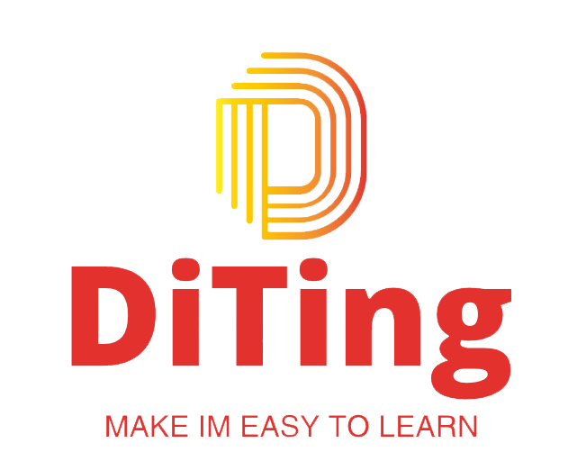

# DiTing：初学者的第一个 IM 项目
欢迎来到 DiTing！这是一个简单、轻量级的即时通讯（IM）开源项目，采用 Go 编写，严格遵守互联网开发标准。致力于为初学者提供一个友好、易于上手的 IM 解决方案，让你可以轻松入门并开始构建自己的即时通讯应用。

## 寻找前端合作者
我们正在积极寻找对前端技术有热情并愿意为 DiTing 项目贡献力量的合作者！无论你是前端新手还是资深开发者，都欢迎加入我们的团队，共同完善和优化 DiTing 的前端体验。
如果你对成为 DiTing 的前端合作者感兴趣，请通过以下方式与我们联系：
- 在 GitHub 上通过 Issue 或者 Pull Request 与我们交流你的想法和贡献。
- 扫描下方微信联系作者。

我们非常期待与你的合作，一起打造出一个卓越的 IM 项目！

## 项目导航
- 学习文档：[DiTing文档](https://danmuking.github.io/)
- 项目交流群：🎉 欢迎加入 DiTing 交流群！这是一个与其他开发者交流、分享经验和获取项目相关支持的地方。在这里你可以不仅可以提出遇到的任何问题，同时欢迎你与其他开发者交流并且对DiTing提出任何建议！
- 码云仓库：[Gitee](https://gitee.com/danmuking/DiTing-Go)
- Github仓库：[Github](https://github.com/danmuking/DiTing-Go)

### 技术选型
| 技术          | 说明               | 官网 |
|-------------|------------------| ----------- |
| Gin         | web开发必备框架        |https://gin-gonic.com/|
| GORM        | ORM框架            |https://gorm.io/docs/index.html|
| GEN         | ORM自动生成工作        |https://gorm.io/docs/index.html|
| Redis       | 缓存加速，多数据结构支持业务功能 |https://redis.io|
| Jwt         | 用户登录，认证方案        |https://jwt.io|
| Swagger-UI	 | API文档生成工具        |https://github.com/swagger-api/swagger-ui|
| Redsync	    | GO的分布式锁工具        |https://github.com/go-redsync/redsync|
| RocketMQ	   | 低延迟、高并发、高可用、高可靠的分布式消息中间件        |https://rocketmq.apache.org/|

### Star 趋势

### 贡献者

<!-- readme: collaborators,contributors -start -->
<table>
<tr>
    <td align="center">
        <a href="https://github.com/danmuking">
            
             
            <b>LinYi</b>
        </a>
    </td>
    <td align="center">
        <a href="https://github.com/Soce1lo">
            
             
            <b>Soce1lo</b>
        </a>
    </td>
    <td align="center">
        <a href="https://github.com/quan-CN">
            
             
            <b>Quan</b>
        </a>
    </td></tr>
</table>
<!-- readme: collaborators,contributors -end -->

### 共建邀请
DiTing 项目不仅是一个简单的即时通讯解决方案，更是一个汇聚了热爱技术、追求卓越的开发者们的大家庭。我们拥有完整的社群体系，以及积极、友好的交流氛围，让每一位参与者都能在这里找到归属感，收获成长与快乐。

如果你对 DiTing 项目感兴趣，愿意贡献你的智慧和力量，我们非常欢迎你的加入！无论你是前端、后端、测试还是其他领域的开发者，都能在 DiTing 项目中找到你的舞台。你可以参与代码编写、功能优化、文档完善等各个方面的工作，与我们一起共同推动项目的进步。

同时，我们也非常欢迎非技术领域的朋友们加入我们的社群，分享你的想法和建议，帮助我们更好地完善项目和服务。

为了更好地联系和交流，你可以尝试添加我的微信，共同为 DiTing 项目的发展贡献力量。

### 作者
DanMu
如果你需要帮助，可以尝试添加我的微信，我会尽力帮助你。

### 捐赠
如果你觉得这个项目对你有帮助，你可以请作者喝一杯咖啡。

### 版权说明

该项目签署了MIT 授权许可，详情请参阅 [LICENSE.txt](./LICENSE)

### 鸣谢

[//]: # (- [GitHub Emoji Cheat Sheet]&#40;https://www.webpagefx.com/tools/emoji-cheat-sheet&#41;)

[//]: # (- [Img Shields]&#40;https://shields.io&#41;)

[//]: # (- [Choose an Open Source License]&#40;https://choosealicense.com&#41;)

[//]: # (- [GitHub Pages]&#40;https://pages.github.com&#41;)

[//]: # (- [Animate.css]&#40;https://daneden.github.io/animate.css&#41;)

[//]: # (- [xxxxxxxxxxxxxx]&#40;https://connoratherton.com/loaders&#41;)
